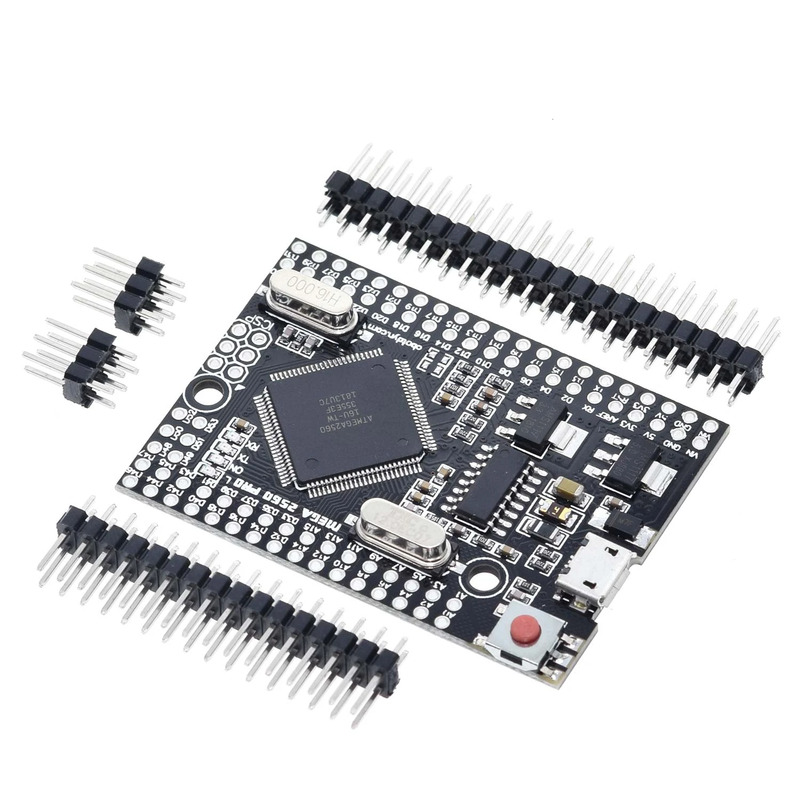
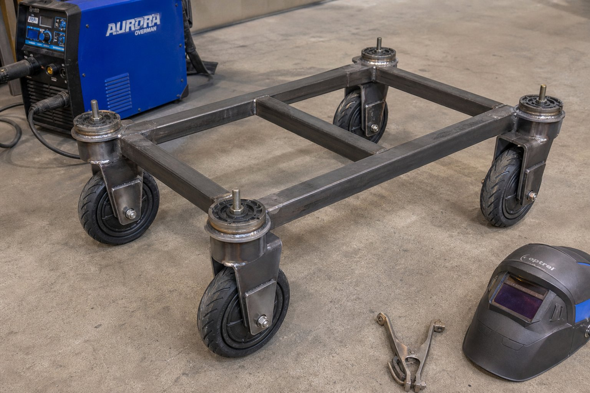

# Автономный робот-курьер с крабовым ходом (4WIS / 4WID) для НТЦ АО «АВТОВАЗ»

[](https://docs.ros.org/)
[](https://ubuntu.com/)
[-00979D.svg)](https://www.arduino.cc/)
[](#2-основные-технические-характеристики)
[-22c55e.svg)](#-спецификация-батарейного-блока-lifepo4-12s-3p)
[](#-кинематика-крабового-хода-4wis--4wid)
[](docs/EXPLANATORY_NOTE_AVTOVAZ.md)

Комплект инженерно-технической документации, сборочных схем, принципиальных электрических схем, алгоритмов кинематики, прошивок микроконтроллеров и узлов ROS 2 для тяжелого автономного робота грузоподъемностью **250 кг** с полноуправляемым шасси (**4WIS / 4WID** — независимый поворот и тяга каждого из 4 колес).

Проект разработан в соответствии с требованиями конкурсного задания № 2: **«Автономное роботизированное устройство для внутренней логистики Научно-технического центра (НТЦ) АО «АВТОВАЗ»»** ([Регламент соревнований](https://pervye-events.hb.ru-msk.vkcloud-storage.ru/projects/documents/aac931ed623a48abb28c4cf1d844b4da.pdf)).

---

## 📌 Навигация по документации

| Документ | Содержание | Ссылка |
| :--- | :--- | :--- |
| 📘 **Полный технический паспорт** | Инженерные расчеты прочности рамы под 250 кг, редуктора GT2 150/20, ступиц Subaru, АКБ | [`docs/TECHNICAL_SPECIFICATION.md`](docs/TECHNICAL_SPECIFICATION.md) |
| 📑 **Пояснительная записка по регламенту** | Пояснительная записка по критериям задания № 2 (экономика, сравнение с 3 аналогами, методика тестов) | [`docs/EXPLANATORY_NOTE_AVTOVAZ.md`](docs/EXPLANATORY_NOTE_AVTOVAZ.md) |
| ⚡ **Электрические схемы и подключения** | Таблицы соединений Mega Pro, TB6600 и собственного драйвера BLDC (MOSFET), расчет предохранителей | [`docs/ELECTRICAL_AND_PINOUTS.md`](docs/ELECTRICAL_AND_PINOUTS.md) |
| 💻 **Прошивка микроконтроллеров** | C++ исходный код для 4 плат Arduino Mega Pro с 6-тактной коммутацией собственного драйвера BLDC и телеметрией 20 Гц | [`firmware/module_controller/`](firmware/module_controller/module_controller.ino) |
| 🎛 **Печатная плата модуля (PCB)** | Полный пакет для разводки платы (BOM, Netlist KiCad/EasyEDA, распиновки, гайд) | [`pcb/`](pcb/README.md) |
| 🧠 **Архитектура ПО (ROS 2)** | Полная архитектура: пакеты, узлы, топики, дерево TF, режимы запуска | [`docs/SOFTWARE_ARCHITECTURE.md`](docs/SOFTWARE_ARCHITECTURE.md) |
| 🔌 **Протокол обмена** | Кадры команд и телеметрии между бортовым ПК и модулями (CRC16) | [`docs/SERIAL_PROTOCOL.md`](docs/SERIAL_PROTOCOL.md) |
| 🤖 **Пакеты ROS 2** | 8 пакетов: кинематика, мост модулей, одометрия, лидар, восприятие, навигация, безопасность, запуск | [`ros2_ws/src/`](ros2_ws/src/) |

---

## 📸 Галерея основных узлов и компонентов

| Узел / Компонент | Изображение | Параметры и роль в конструкции |
| :---: | :---: | :--- |
| **Опорно-поворотный узел**<br>(Ступицы Subaru) |  | Автомобильные ступицы Subaru Forester/Impreza с двухрядным радиально-упорным подшипником. Нулевой люфт, динамическая стойкость >38 кН (с избытком выдерживает нагрузку 250 кг). |
| **Привод поворота**<br>(NEMA 23 + Редуктор 1:7.5) | <br> | Шаговый двигатель NEMA 23 (1.9 Н·м, 2.8 А) с зубчато-ременной передачей **GT2 10 мм** (шкивы $z_1=20$, $z_2=150$, $i=7.5$). Итоговый момент на ступице: **13.68 Н·м**, дискретность: **0.03°**. |
| **Тяговый привод 4WD**<br>(Мотор-колеса Xiaomi M365 Pro) |  | 4 мотор-колеса Xiaomi Mijia M365 Pro (10", BLDC) номинальной мощностью **260 Вт** каждое со встроенными квадратурными энкодерами и датчиками Холла. Суммарно 1040 Вт ном. |
| **Локальный контроллер**<br>(Arduino Mega Pro Embed) |  | Микроконтроллер ATmega2560 (16 МГц, 54 I/O). По 1 плате на каждый из 4 модулей. Аппаратный ШИМ 31.25 кГц, прерывания Холла, UART-связь с CRC16. |
| **Драйвер шаговика**<br>(TB6600) |  | Микрошаговый драйвер (ток 2.8 А, микрошаг 1/8). Оптоизолированные входы PUL/DIR/ENA. |
| **Собственный драйвер BLDC**<br>(3-фазный MOSFET-инвертор) |  | **Собственная разработка, покупные ESC не применяются:** 6 силовых N-MOSFET (IRFB4110 / 100V 180A, $R_{DS(on)} \le 4.5$ мОм), драйвер затворов FD6288Q/IR2101, токовый шунт, собственная печатная плата. |
| **Тяговая батарея**<br>(LiFePO4 32700 12S3P) |  | 36 ячеек LiFePO4 32700 (3.2 В, 6200 мА·ч). Номинал 38.4 В, 18.6 А·ч, 714.2 Вт·ч. Высокая безопасность (не горит, не взрывается), ресурс >2500 циклов. |

---

## 🏗 Архитектура системы управления

Комплекс построен по двухуровневой схеме управления:
1. **Верхний уровень:** Бортовой компьютер под управлением **Ubuntu 24.04/26.04 LTS** со стеком **ROS 2**. Обеспечивает картографирование и локализацию (SLAM), планирование маршрута (Nav2) на основе данных **Лидара LDC 01**, распознавание дорожных знаков («Стоп», «Пешеходный переход», «Искусственная неровность») и светофоров камерой, а также расчет кинематики 4WIS/4WID.
2. **Нижний уровень:** 4 независимых контроллера поворотно-тяговых модулей (**Arduino Mega Pro Embed**), каждый из которых управляет шаговиком NEMA 23 (TB6600) и собственным драйвером BLDC — 3-фазным MOSFET-инвертором мотор-колеса 260 Вт.


---

## 🛠 Фотографии изготовленного шасси (Промежуточный конструктив)

Реальные фотографии изготовленной несущей рамы и ходовой части мобильной платформы на этапе механической сборки в мастерской (сварочный полуавтомат Aurora PRO Overman, профиль 40×40 мм со скошенными углами 45°, ступицы Subaru, колеса Xiaomi M365 Pro):

| Вид сверху (Рама 40×40 мм, скосы 45°, ступицы Subaru) | Вид сбоку (Вертикальный стек: шпилька → ступица → вилка) | Перспектива 3/4 (Шасси в сборе на 4 колесах) |
| :---: | :---: | :---: |
|  |  |  |

---

## 📐 Сборка поворотного модуля (Swerve Pod): Шкив/Шестерня → Ступица → Вилка

Конструкция поворотного модуля строго следует вертикальной иерархии:

```text
  1. [ВЕДОМЫЙ ШКИВ / ШЕСТЕРНЯ z2=150] (СВЕРХУ на центральной шпильке М16/М20)
                     │
  2. [АВТОМОБИЛЬНАЯ СТУПИЦА SUBARU]  (ПОСЕРЕДИНЕ, вварена в раму 40×40 мм)
                     │
  3. [ПОВОРОТНАЯ СТАЛЬНАЯ ВИЛКА]     (СНИЗУ, закреплена к вращающейся части ступицы)
                     │
  4. [МОТОР-КОЛЕСО XIAOMI M365 PRO]  (В ВИЛКЕ, перфорированная шина с красным кантом)
```


### Ключевые параметры узла:
- **Рама:** Сварная из стальной квадратной трубы 40×40×2 мм (Ст3сп) с диагональными скосами углов 45°;
- **Опорно-поворотный узел:** Автомобильная ступица Subaru с двухрядным радиально-упорным подшипником (>38 кН);
- **Приводная шестерня/шкив сверху:** Ведомый шкив **GT2 10 мм** ($z_2 = 150$), ведущий шкив NEMA 23 ($z_1 = 20$), редукция $1:7.5$;
- **Крутящий момент поворота:** Результирующий момент на ступице **13.68 Н·м** (запас >35% при повороте на месте с грузом 250 кг);
- **Поворотная вилка снизу:** Сварная из листовой стали 5–6 мм;
- **Тяговый привод:** Бесщеточное мотор-колесо Xiaomi M365 Pro 10 дюймов (260 Вт) с цельнолитыми перфорированными шинами, датчиками Холла и встроенным квадратурным энкодером (каналы A/B).

---

## 🔄 Кинематика крабового хода (4WIS / 4WID)


1. **Крабовый ход (Crab Walk):** Все 4 колеса синхронно ориентируются под одинаковым углом $\theta$. Робот перемещается по диагонали или строго вбок без изменения ориентации корпуса ($\omega_z = 0$).
2. **Разворот на месте с нулевым радиусом (Zero-Radius Spin, $R = 0$):** Плоскости качения всех 4 колес разворачиваются **строго по касательным к окружности описания шасси** (перпендикулярно диагональным лучам от центра робота). Векторы тяги колес образуют замкнутый круговой контур в направлении $\Omega$, обеспечивая чистое вращение вокруг центра масс без бокового проскальзывания и износа резины.
3. **Криволинейное движение (Ackerman / Omnidirectional Trajectory):** Согласованное управление углами и скоростями для плавного огибания препятствий.

---

## ⚡ Схема платы модуля управления


Каждая из 4 плат объединяет микроконтроллер ATmega2560, драйвер TB6600 и силовую часть собственного драйвера BLDC: 3-фазный мост на 6 транзисторах IRFB4110 с драйвером затворов FD6288Q (своя печатная плата, покупные ESC не используются).

---

## 🔋 Спецификация батарейного блока LiFePO4 12S 3P

| Параметр | Значение |
| :--- | :--- |
| **Тип ячеек** | Цилиндрические LiFePO4 банки **32700** |
| **Конфигурация** | **12S 3P** (36 банок: 12 последовательных троек) |
| **Номинальное напряжение** | **38.4 В** ($12 \times 3.2$ В) |
| **Диапазон рабочих напряжений** | от 30.0 В (разряд) до 43.8 В (полный заряд) |
| **Емкость сборки** | **18.6 А·ч** ($3 \times 6200$ мА·ч) |
| **Энергоемкость** | **714.2 Вт·ч** |
| **Плата защиты (BMS)** | Smart BMS 12S 60A с контролем температуры ячеек (NTC) и балансировкой |
| **Безопасность** | Полная устойчивость к тепловому разгону, отсутствие риска возгорания |

---

## 📋 Сводная таблица параметров робота

| Параметр | Значение | Соответствие регламенту Задания №2 |
| :--- | :--- | :--- |
| **Габариты платформы (Д × Ш × В)** | **750 × 600 × 400 мм** | Норматив: от 600×400×400 до 1200×800×800 мм ✅ |
| **Полезная грузоподъемность** | **250 кг** | Подтверждено расчетом прочности рамы 40×40 мм и ступиц Subaru ✅ |
| **Размер отсека для груза** | 420 × 340 × 200 мм | Норматив: прямоугольник $\ge 300\times 250\times 60$, цилиндр $\ge 200\times 100$ мм ✅ |
| **Защита груза** | Герметичный отсек IP65 + замок с авторизацией по QR/RFID | Защита от осадков и несанкционированного доступа ✅ |
| **Материал рамы** | Стальная профильная труба 40×40×2 мм, сварная | Прочный цельносварной металлокаркас ✅ |
| **Опорно-поворотные узлы** | Автомобильные ступицы Subaru Forester/Impreza | Двухрядные подшипники, запас прочности под 250 кг груза ✅ |
| **Привод поворота** | 4 × NEMA 23 + ремень **GT2 10 мм** (шкивы 150 и 20) | Редукция 1:7.5, момент 13.68 Н·м, точность 0.03° ✅ |
| **Тяговый привод** | 4 × мотор-колеса Xiaomi M365 Pro 10" (по **260 Вт** BLDC с энкодерами) | Полноприводное шасси 4WD, суммарно 1040 Вт ном. ✅ |
| **Управление модулями** | 4 платы (Arduino Mega Pro + TB6600 + собственный драйвер BLDC на MOSFET) | Распределенная микроконтроллерная сеть ✅ |
| **Бортовой компьютер** | Ubuntu 24.04/26.04 LTS (ROS 2 Nav2, SLAM) | Автономная навигация без оператора ✅ |
| **Сенсоры навигации** | **Лидар LDC 01** (360°) + Камера машинного зрения | Распознавание знаков («Стоп», светофор, неровность) ✅ |
| **Световая/звуковая сигнализация**| Светоотражающая оклейка 3M, янтарный маячок, звуковой зуммер 85 дБ | Безопасность в темное время суток и на производстве ✅ |
| **Статус испытаний** | Программа контрольных тестов разработана по регламенту | Готовность к полигонным испытаниям на этапе соревнований ✅ |

---

## 🚀 Инструкция по сборке и запуску ПО

### 1. Прошивка плат Arduino Mega Pro
1. Откройте файл [`firmware/module_controller/module_controller.ino`](firmware/module_controller/module_controller.ino) в среде Arduino IDE.
2. Для каждого из 4 модулей установите уникальный `#define MODULE_ID` (1 для FL, 2 для FR, 3 для RL, 4 для RR).
3. Выберите плату **Arduino Mega or Mega 2560** и порт подключения `/dev/ttyUSB0`...`/dev/ttyUSB3`.
4. Загрузите прошивку в микроконтроллеры.

### 2. Сборка ПО (бортовой компьютер, Ubuntu 24.04/26.04 + ROS 2)
```bash
cd ~/rus_slam/ros2_ws

# Зависимости (один раз)
sudo apt install -y python3-serial python3-opencv \
     ros-$ROS_DISTRO-slam-toolbox ros-$ROS_DISTRO-navigation2 \
     ros-$ROS_DISTRO-nav2-bringup ros-$ROS_DISTRO-robot-state-publisher \
     ros-$ROS_DISTRO-xacro python3-colcon-common-extensions

# Сборка всех пакетов
colcon build --symlink-install
source install/setup.bash

# Права на порты и стабильные имена устройств (один раз)
sudo usermod -a -G dialout $USER
sudo cp src/rus_slam_bringup/udev/99-rus-slam.rules /etc/udev/rules.d/
sudo udevadm control --reload-rules && sudo udevadm trigger
```

### 3. Запуск робота
```bash
# Базовый запуск (железо + кинематика + сенсоры + безопасность)
ros2 launch rus_slam_bringup robot.launch.py

# Проверка стека без железа (симуляция модулей)
ros2 launch rus_slam_bringup robot.launch.py sim:=true

# Полный запуск: картирование полигона (запись карты, телеуправление)
ros2 launch rus_slam_bringup full.launch.py slam:=true

# Полный запуск: навигация по готовой карте + миссия доставки
ros2 launch rus_slam_bringup full.launch.py slam:=false map:=~/maps/ntc.yaml

# Хоминг модулей (поиск нулевого азимута) перед первой поездкой
ros2 service call /home_modules rus_slam_interfaces/srv/HomeModules {}
```

### 4. Тестирование движения (телеуправление через гейт безопасности)
```bash
# Команды подаются на /cmd_vel_nav — узел безопасности проверяет здоровье
# модулей и АКБ и транслирует их в /cmd_vel

# Движение вперед со скоростью 0.8 м/с
ros2 topic pub --once /cmd_vel_nav geometry_msgs/msg/Twist "{linear: {x: 0.8, y: 0.0, z: 0.0}, angular: {z: 0.0}}"

# Крабовый ход: диагональное движение под 45 градусов
ros2 topic pub --once /cmd_vel_nav geometry_msgs/msg/Twist "{linear: {x: 0.5, y: 0.5, z: 0.0}, angular: {z: 0.0}}"

# Разворот на месте с нулевым радиусом (вращение вокруг центра)
ros2 topic pub --once /cmd_vel_nav geometry_msgs/msg/Twist "{linear: {x: 0.0, y: 0.0, z: 0.0}, angular: {z: 0.8}}"
```

Полное описание узлов, топиков и режимов — в
[`docs/SOFTWARE_ARCHITECTURE.md`](docs/SOFTWARE_ARCHITECTURE.md).

---

## 👥 Авторы и принадлежность

- **Организация:** НТЦ АО «АВТОВАЗ» / Конкурс «Первые в профессии»
- **Направление:** Транспортная сфера «Автомобильный транспорт»
- **Задание:** Задание № 2 «Автономное роботизированное транспортное средство для внутренней логистики НТЦ АО «АВТОВАЗ»»
- **Лицензия:** MIT License
