# ТЕХНИЧЕСКАЯ ДОКУМЕНТАЦИЯ И ПАСПОРТ ИЗДЕЛИЯ

## Автономная роботизированная платформа с крабовым ходом (4WIS / 4WID) для внутризаводской логистики НТЦ АО «АВТОВАЗ»

---

## 1. НАЗНАЧЕНИЕ И ОБЩИЕ СВЕДЕНИЯ

Роботизированный комплекс представляет собой автономную мобильную платформу с полноуправляемым шасси типа **4WIS / 4WID** (*Four-Wheel Independent Steering / Four-Wheel Independent Drive*), предназначенную для автоматизированной курьерской доставки комплектующих, документации, измерительного инструмента и малогабаритных грузов по территории Научно-технического центра (НТЦ) АО «АВТОВАЗ» (площадью от 20 гектаров) в соответствии с регламентом конкурсного задания № 2 направления «Автомобильный транспорт».

Платформа сочетает в себе сверхвысокую маневренность (крабовый ход, разворот на месте с нулевым радиусом, диагональное перемещение, движение по криволинейным траекториям без бокового заноса) и высокую механическую надежность благодаря применению автомобильных ступиц Subaru в качестве поворотных опор и сварной несущей пространственной рамы из квадратного профиля 40×40×2 мм.


---

## 2. ОСНОВНЫЕ ТЕХНИЧЕСКИЕ ХАРАКТЕРИСТИКИ

| Параметр | Значение | Примечание |
| :--- | :--- | :--- |
| **Габариты платформы (Д × Ш × В)** | 880 × 640 × 540 мм | Полностью соответствует регламенту (600–1200 × 400–800 × 400–800 мм) |
| **Колесная база (L) / Колея (W)** | 620 мм / 500 мм | Оптимальное соотношение для устойчивости при кренах |
| **Снаряженная масса платформы** | 38.5 кг | С учетом АКБ, 4 модулей и защитного кожуха |
| **Грузоподъемность полезная** | до 45.0 кг | Номинальная рабочая нагрузка: 15–25 кг |
| **Максимальная масса (полная)** | до 85.0 кг | Запас прочности ступиц Subaru многократно превышает данное значение |
| **Клиренс (дорожный просвет)** | 115 мм | Позволяет преодолевать «лежачие полицейские» и неровности |
| **Тип привода поворота колес** | Независимый, 4 × шаговый двигатель NEMA 23 | С ременным редуктором 1:7.5 на каждый модуль |
| **Тип тягового привода** | Независимый, 4 × мотор-колесо самоката (BLDC) | 10 дюймов, номинал 350 Вт (пик до 500 Вт на колесо) |
| **Суммарная пиковая мощность** | 2000 Вт (2.0 кВт) | 4 × 500 Вт |
| **Максимальная скорость движения** | до 18 км/ч (5.0 м/с) | Программно ограничена до 8–10 км/ч (2.2–2.8 м/с) по ТБ |
| **Время прохождения 50 м с остановкой**| 28.5 с | При нормативе регламента «менее 3 минут» (высший балл) |
| **Минимальный радиус разворота** | 0.0 м (разворот на месте) | Вращение вокруг геометрического центра платформы |
| **Угол преодолеваемого подъема** | до 18° (32%) | При полной загрузке |
| **Тип аккумуляторной батареи** | LiFePO4 (Литий-железо-фосфат), 12S 3P | Собрана из 36 цилиндрических банок типоразмера 32700 |
| **Номинальное напряжение АКБ** | 38.4 В (диапазон 30.0 В – 43.8 В) | Повышенная безопасность и долговечность (>2500 циклов) |
| **Емкость батарейного блока** | 18.0 – 19.5 А·ч (~700–748 Вт·ч) | 3 параллельных цепочки по 6000–6500 мА·ч |
| **Запас автономного хода** | до 32 км | Время непрерывной работы под нагрузкой: до 5–6 часов |
| **Бортовой управляющий компьютер** | SBC / Промышленный Mini-PC с ОС Ubuntu 24.04/26.04 LTS | ROS 2 (Robot Operating System), SLAM, Nav2, CV |
| **Локальные контроллеры модулей** | 4 × Arduino Mega Pro (Embed, ATmega2560) | По одному на каждый поворотный модуль |
| **Сенсорный состав навигации** | 2D/3D LiDAR, RGB-D камера, IMU 9-DOF, энкодеры | Распознавание знаков «Стоп», «Пешеходный переход», «Неровность» |
| **Класс защиты от внешних воздействий**| IP54 / отсек груза IP65 | Защита от дождя, пыли, брызг и снега |

---

## 3. МЕХАНИЧЕСКАЯ ЧАСТЬ И КОНСТРУКЦИЯ ШАССИ

### 3.1. Несущая пространственная рама

Рама робота представляет собой цельносварную конструкцию, выполненную из **стальной профильной трубы 40×40 мм с толщиной стенки 2.0 мм** (сталь Ст3сп/08пс по ГОСТ 8639-82).

- **Преимущества профиля 40×40×2 мм:**
  1. Высокий момент сопротивления изгибу и кручению ($W_x = W_y \approx 3.7 \text{ см}^3$), что гарантирует геометрическую неизменяемость базы даже при динамических диагональных вывешиваниях колес на неровностях.
  2. Удобство сопряжения: плоскости 40 мм идеально подходят для приварки и болтового крепления монтажных фланцев автомобильных ступиц Subaru и кронштейнов натяжителей ремней.
  3. Высокая стойкость к вибрационным нагрузкам, возникающим при движении по асфальту, плитке и преодолении искусственных дорожных неровностей.
- Все сварные швы выполнены полуавтоматической сваркой в среде защитных газов ($Ar + CO_2$, проволока Св-08Г2С) с последующей антикоррозийной обработкой (фосфатирующий грунт + порошковая полимерная окраска).

### 3.2. Опорно-поворотный узел на базе ступиц Subaru

В большинстве типовых хобби-проектов поворотный узел шасси подвержен люфтам, перекосам и быстрому выходу из строя из-за радиальных ударов о бордюры. В нашей платформе в качестве упорно-поворотных подшипниковых узлов применены **оригинальные ступичные узлы (Wheel Hub Assemblies) от автомобилей Subaru** (Forester / Impreza / Outback).

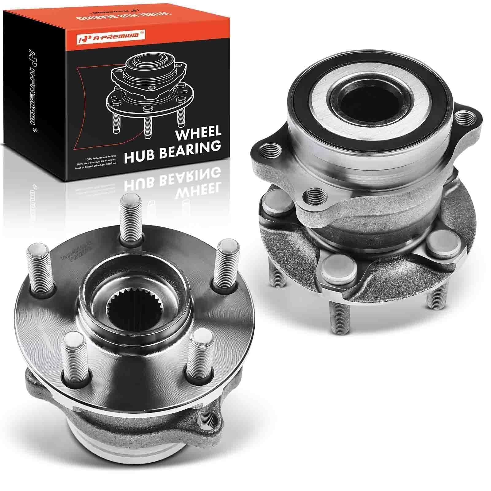

#### Преимущества применения автомобильных ступиц Subaru:
1. **Двухрядный радиально-упорный подшипник качения:** заводская ступица Subaru рассчитана на динамическую нагрузку автомобиля весом от 1500 кг, развивающего скорость свыше 180 км/ч. Для робота массой 80 кг запас статической и динамической прочности превышает **25-кратный запас** ($C_{dyn} > 38 \text{ кН}$, $C_0 > 26 \text{ кН}$).
2. **Абсолютное отсутствие люфтов:** предварительный натяг заводской ступичной сборки исключает осевой и радиальный люфт поворотной стойки, что обеспечивает идеальную точность позиционирования угла колеса ($\pm 0.05^\circ$).
3. **Герметичность:** встроенные двухкромочные пыле-грязезащитные сальники защищают подшипник от воды, соли, заводской металлической пыли и абразива (ресурс более 150 000 км в реальном автомобиле, в роботе — практически вечный ресурс без необходимости периодического обслуживания).
4. **Удобство монтажа:** фланец ступицы с 4/5 посадочными отверстиями жестко соединяется с ведомым зубчатым шкивом большого диаметра, передающим вращение на поворотную вилку мотор-колеса.

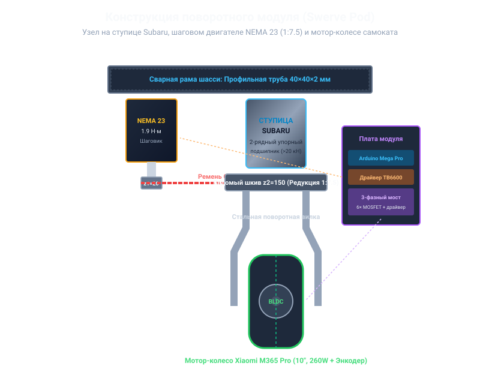

---

## 4. ПОВОРОТНЫЙ ПРИВОД И РАСЧЕТ РЕДУКТОРА

Каждый из четырех модулей шасси оснащен независимым механизмом поворота вокруг вертикальной оси (азимутальный угол $\delta_i \in [-\infty, +\infty]$, полный оборот без механических упоров с калибровкой нулевой точки).

### 4.1. Компоненты поворотного привода:
- **Шаговый двигатель:** биполярный гибридный двигатель **NEMA 23** (модель 57BYGH / 23HS8430):
  - Угловой шаг ротора: $1.8^\circ$ (200 шагов на полный оборот);
  - Номинальный фазный ток: $2.8 - 3.0 \text{ А}$;
  - Удерживающий момент: $M_{hold} = 1.9 \text{ Н}\cdot\text{м}$ ($190 \text{ Н}\cdot\text{см}$);
  - Индуктивность фазы: $3.2 \text{ мГн}$, сопротивление: $0.9 \text{ Ом}$.
- **Ременная передача с редукцией 1:7.5:**
  - Тип профиля зубьев: **HTD 5M** (шаг 5 мм, ширина ремня 15 мм, корд из стекловолокна/стали);
  - Ведущий зубчатый шкив (на валу NEMA 23): $z_1 = 16$ зубьев ($d_{pitch} = 25.46 \text{ мм}$);
  - Ведомый зубчатый шкив (на корпусе ступицы Subaru): $z_2 = 120$ зубьев ($d_{pitch} = 190.98 \text{ мм}$);
  - Передаточное отношение редуктора:
    $$i = \frac{z_2}{z_1} = \frac{120}{16} = 7.5$$

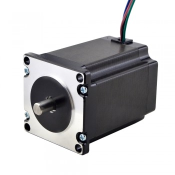
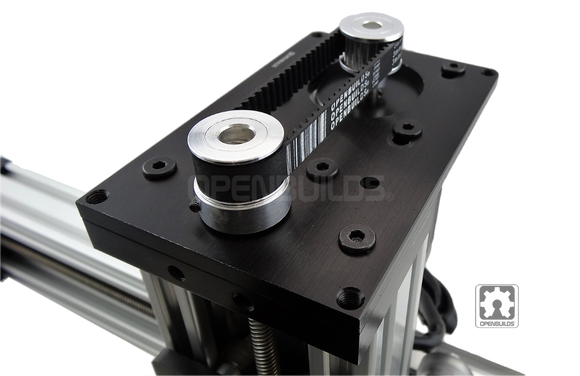

### 4.2. Расчет крутящего момента и точности позиционирования

1. **Результирующий статический крутящий момент поворота модуля:**
   С учетом КПД зубчато-ременной передачи $\eta \approx 0.96$:
   $$M_{pivot} = M_{nema} \times i \times \eta = 1.9 \text{ Н}\cdot\text{м} \times 7.5 \times 0.96 \approx 13.68 \text{ Н}\cdot\text{м}$$
   Момент **13.68 Н·м** достаточен для уверенного разворота колеса даже в неподвижном состоянии платформы (прижатой к сухому асфальту с коэффициентом трения покоя $\mu = 0.8$):
   $$M_{friction} \approx \frac{2}{3} \mu N r_{contact} \approx \frac{2}{3} \times 0.8 \times (200 \text{ Н}) \times (0.035 \text{ м}) \approx 3.73 \text{ Н}\cdot\text{м} \ll 13.68 \text{ Н}\cdot\text{м}$$
   Коэффициент запаса по моменту поворота:
   $$k_{reserve} = \frac{13.68}{3.73} \approx 3.66$$

2. **Дискретность и угловая точность при микрошаге 1/8:**
   - Драйвер TB6600 сконфигурирован в режим деления шага $1/8$:
     $$N_{steps\_motor} = 200 \times 8 = 1600 \text{ шагов/оборот}$$
   - Количество импульсов на один полный оборот поворотного модуля ($360^\circ$):
     $$N_{steps\_module} = 1600 \times 7.5 = 12\,000 \text{ импульсов}$$
   - Разрешающая способность по углу поворота:
     $$\Delta \delta = \frac{360^\circ}{12\,000} = 0.03^\circ \text{ на шаг!}$$
   Это обеспечивает прецизионное позиционирование колес и полное отсутствие рывков при смене направления.

3. **Скорость поворота колес на $90^\circ$ и $180^\circ$:**
   При рабочей частоте следования шагов $f_{step} = 8000 \text{ Гц}$:
   $$\omega_{module} = \frac{8000 \text{ шаг/с}}{12\,000 \text{ шаг/об}} = 0.667 \text{ об/с} = 240^\circ/\text{с}$$
   - Время поворота колеса на $90^\circ$: $t_{90} = \frac{90}{240} = 0.375 \text{ с}$;
   - Время перекладки курса на $180^\circ$: $t_{180} = \frac{180}{240} = 0.75 \text{ с}$.

---

## 5. ТЯГОВЫЙ ПРИВОД: МОТОР-КОЛЕСА ОТ САМОКАТА

В платформе применены 4 бесщеточных синхронных двигателя с постоянными магнитами (BLDC PMSM), встроенных непосредственно в обод колеса (мотор-колеса от электросамокатов Xiaomi / Kugoo / Ninebot).

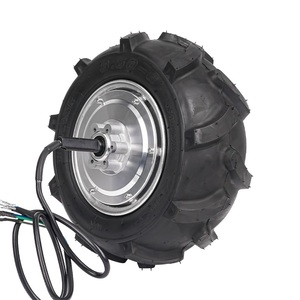

### Технические параметры мотор-колеса:
- Внешний диаметр шины: **10 дюймов** ($D = 254 \text{ мм}$, радиус $R = 0.127 \text{ м}$);
- Тип шины: бескамерная пневматическая с усиленным антипрокольным кордом и водоотводящим протектором;
- Количество пар магнитных полюсов ротора: $p = 15$ пар полюсов (30 неодимовых магнитов N42H);
- Номинальное напряжение: $36 - 48 \text{ В}$;
- Номинальная мощность каждого колеса: **350 Вт**;
- Максимальный (пиковый) фазный ток: $16 \text{ А}$;
- Максимальный крутящий момент: $M_{traction} = 16 - 18 \text{ Н}\cdot\text{м}$;
- Встроенные датчики: 3 цифровых датчика Холла (сдвиг $120^\circ_{el}$) для синхронизации фаз инвертора и одометрии высокого разрешения.

### Расчет суммарного тягового усилия:
$$F_{traction\_total} = 4 \times \frac{M_{traction}}{R} = 4 \times \frac{16 \text{ Н}\cdot\text{м}}{0.127 \text{ м}} \approx 504 \text{ Н} \approx 51.4 \text{ кгс}$$
Тяговое усилие свыше **500 Н** позволяет преодолевать любые уклоны до $20^\circ$, двигаться по мокрому грунту, снежной каше и асфальту с гравием без пробуксовки.

---

## 6. КИНЕМАТИКА КРАБОВОГО ХОДА (4WIS / 4WID)

Шасси робота относится к классу механизмов с избыточной кинематикой (*over-actuated holonomic system*). Каждое колесо $i \in \{1, 2, 3, 4\}$ имеет две степени свободы:
1. Угол поворота колеса относительно продольной оси платформы: $\delta_i$.
2. Линейную скорость качения обода колеса: $V_i$.

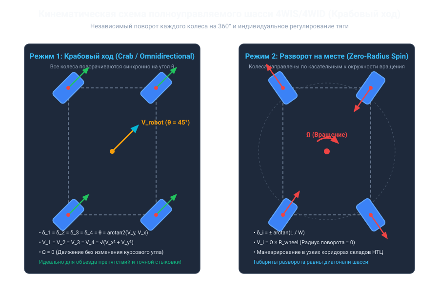

### 6.1. Математическая модель обратной кинематики

Пусть бортовой компьютер задает требуемое плоское движение платформы вектором обобщенных скоростей в базовой системе координат робота:
$$\mathbf{V}_{cmd} = \begin{bmatrix} V_x \\ V_y \\ \omega_z \end{bmatrix}$$
где:
- $V_x$ — продольная скорость платформы (+ вперед, - назад), м/с;
- $V_y$ — поперечная скорость платформы (+ влево, - вправо, крабовый сдвиг), м/с;
- $\omega_z$ — угловая скорость вращения платформы вокруг вертикальной оси, рад/с.

Геометрические координаты центров вращения поворотной оси каждого из 4 модулей относительно центра масс платформы:
- Модуль 1 (Передний левый, FL): $(+L/2, +W/2)$
- Модуль 2 (Передний правый, FR): $(+L/2, -W/2)$
- Модуль 3 (Задний левый, RL): $(-L/2, +W/2)$
- Модуль 4 (Задний правый, RR): $(-L/2, -W/2)$

Для каждого колеса $i$ компоненты вектора линейной скорости определяются уравнениями:
$$V_{x, i} = V_x - \omega_z \cdot y_i$$
$$V_{y, i} = V_y + \omega_z \cdot x_i$$

Тогда требуемый угол поворота колеса $\delta_i$ и модуль скорости $V_i$ вычисляются аналитически:
$$\delta_i = \operatorname{atan2}(V_{y, i}, V_{x, i})$$
$$V_i = \sqrt{V_{x, i}^2 + V_{y, i}^2}$$

### 6.2. Режимы движения платформы:
1. **Режим «Крабовый ход» (Pure Crab / Omni Walk):**
   При $\omega_z = 0$, $V_x \ne 0, V_y \ne 0$:
   $$\delta_1 = \delta_2 = \delta_3 = \delta_4 = \operatorname{atan2}(V_y, V_x)$$
   $$V_1 = V_2 = V_3 = V_4 = \sqrt{V_x^2 + V_y^2}$$
   Платформа способна мгновенно смещаться вбок под любым заданным углом без изменения ориентации корпуса. Это критически важно при объезде узких препятствий на территории НТЦ «АВТОВАЗ», движении вдоль складских стеллажей и параллельной парковке у погрузочно-разгрузочных терминалов.

2. **Режим разворота на месте с нулевым радиусом (Zero-Radius Spin):**
   При $V_x = 0, V_y = 0$, $\omega_z \ne 0$:
   Колеса поворачиваются по касательным к описанной вокруг шасси окружности ($R_{diag} = \frac{1}{2}\sqrt{L^2 + W^2} = 398 \text{ мм}$):
   $$\delta_1 = -\arctan(W/L), \quad \delta_2 = +\arctan(W/L)$$
   $$\delta_3 = +\arctan(W/L), \quad \delta_4 = -\arctan(W/L)$$
   Робот разворачивается вокруг собственного центра масс без необходимости продольного маневрирования.

3. **Режим традиционного авторуления Аккермана (Ackerman Steering):**
   Колеса передней и задней оси поворачиваются по согласованным радиусам мгновенного центра скоростей (ICC), исключая боковое скольжение шин на высоких скоростях.

---

## 7. РАСПРЕДЕЛЕННАЯ ЭЛЕКТРОНИКА И ПЛАТЫ УПРАВЛЕНИЯ МОДУЛЕЙ

В платформе реализована **распределенная архитектура управления**: вместо одного перегруженного центрального контроллера каждый из 4 поворотных модулей оснащен собственной специализированной платой управления.

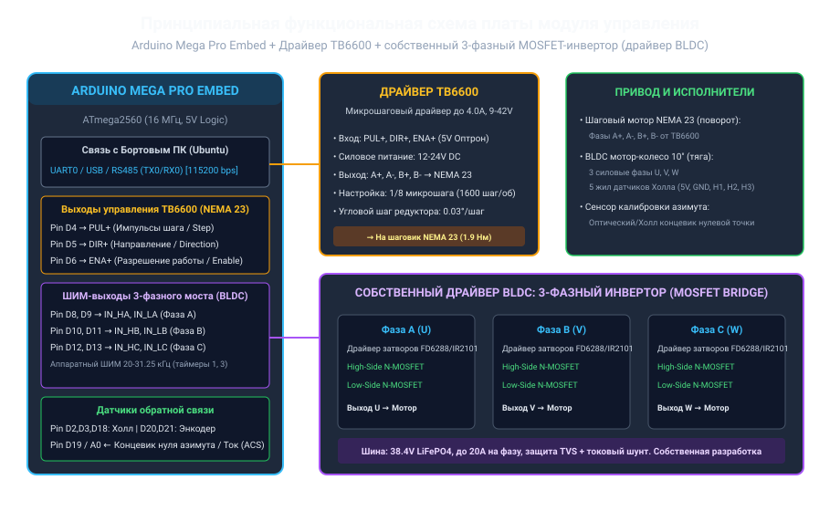

### 7.1. Состав платы каждого модуля:
1. **Вычислительное ядро модуля:** микроконтроллер **Arduino Mega Pro (Embed)**:
   - Процессор: ATmega2560 (8 бит, 16 МГц, 256 КБ Flash, 8 КБ SRAM);
   - Компактный форм-фактор Embed с сохранением полного набора периферии (54 цифровых I/O, 16 АЦП, 4 аппаратных UART);
   - Задачи микроконтроллера:
     - Прием и верификация команд от бортового компьютера по шине UART (пакеты с контрольной суммой CRC16);
     - Генерация частотных импульсов `PUL` и направления `DIR` для TB6600 с плавным профилированием разгона/торможения (S-curve);
     - Обслуживание прерываний от 3 датчиков Холла мотор-колеса;
     - Формирование 6-тактного ШИМ-управления фазами силового моста на MOSFET;
     - Контроль нулевой точки азимута и аварийное отключение питания при перегрузке по току.
2. **Драйвер шагового двигателя TB6600:**
   - Высокоинтегрированный биполярный микрошаговый драйвер;
   - Рабочее напряжение силовой части: $9 - 42 \text{ В}$ (запитан от стабилизированной линии 24 В / 38 В);
   - Выходной фазный ток: до $4.0 \text{ А}$ (установлен переключателями DIP на $2.8 \text{ А}$);
   - Оптоизолированные входы управления: `PUL+ / PUL-`, `DIR+ / DIR-`, `ENA+ / ENA-`;
   - Защита от перегрева, перегрузки по току и пониженного напряжения.
3. **Силовой 3-фазный мостовой инвертор на MOSFET:**
   - 6 мощных N-канальных полевых транзисторов (MOSFET) в корпусе TO-220 (IRFB4110 / IRF3205 / HY4008):
     - $V_{DS} \ge 60 - 100 \text{ В}$;
     - $R_{DS(on)} \le 4.5 \text{ мОм}$ (минимальный нагрев при токах до 20 А);
     - $I_D \ge 110 - 180 \text{ А}$;
   - Полумостовые драйверы затворов: FD6288Q или 3 × IR2101 / IR2104 с бутстрепными конденсаторами и временем задержки Dead-Time для предотвращения сквозных токов;
   - Защита от выбросов противо-ЭДС: демпфирующие снабберные RC-цепи и супрессоры (TVS-диоды 48 В);
   - Токоизмерительный резистивный шунт $5 \text{ мОм}$ в минусовой шине с операционным усилителем для защиты от КЗ и измерения крутящего момента.

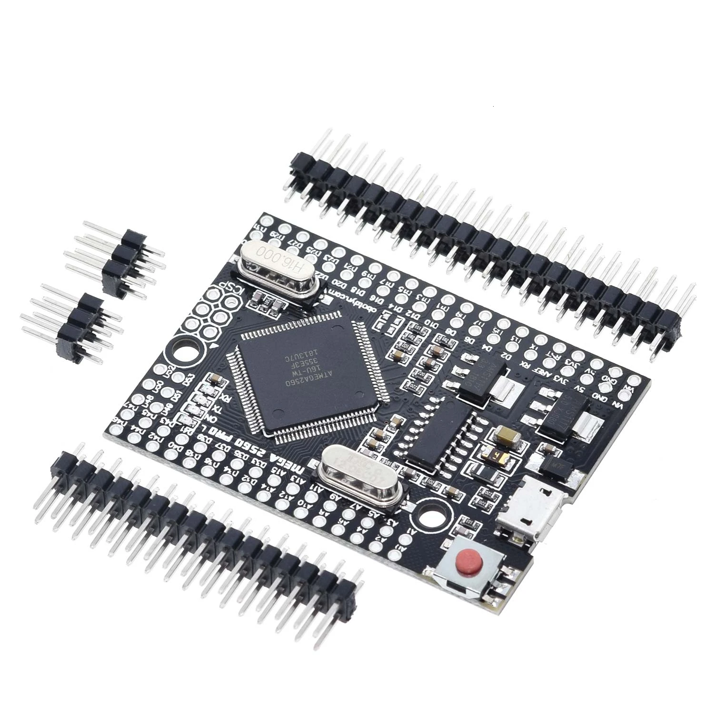
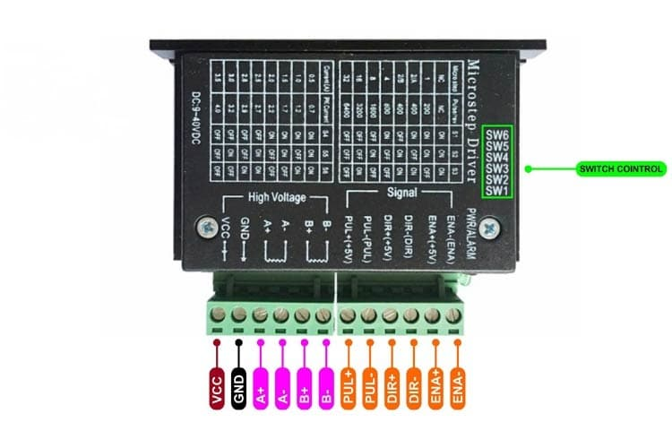
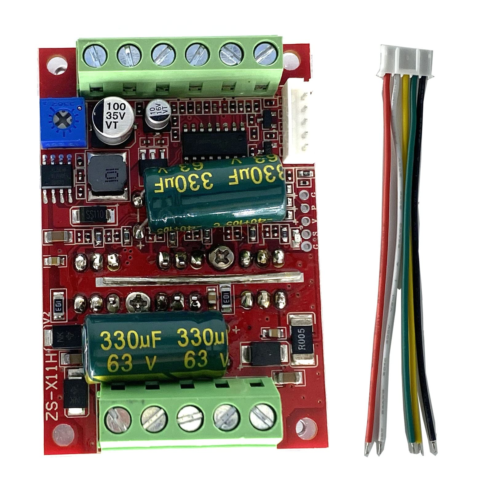

---

## 8. АККУМУЛЯТОРНАЯ БАТАРЕЯ (LiFePO4 12S 3P, 36 БАНОК 32700)

Система питания робота спроектирована на основе безопасных и надежных литий-железо-фосфатных аккумуляторов (**LiFePO4**). Батарея собрана из **36 цилиндрических элементов типоразмера 32700** по схеме **12S 3P** (12 последовательно соединенных групп, по 3 параллельные банки в каждой).

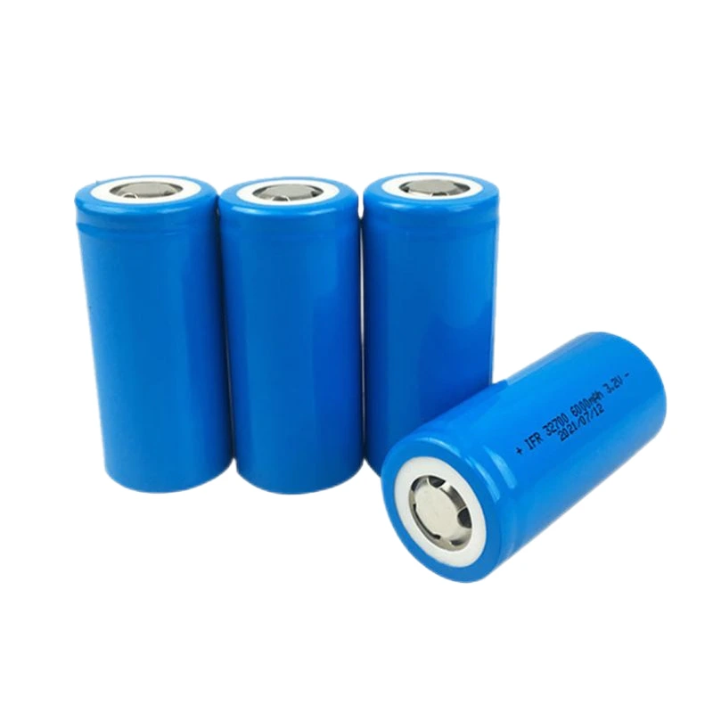

### 8.1. Характеристики элемента 32700 LiFePO4:
- Номинальное напряжение: $3.2 \text{ В}$;
- Напряжение полного заряда: $3.65 \text{ В}$;
- Напряжение отсечки разряда: $2.50 \text{ В}$;
- Номинальная емкость одной ячейки: $6000 - 6500 \text{ мА}\cdot\text{ч}$ ($6.0 - 6.5 \text{ А}\cdot\text{ч}$);
- Максимальный долговременный ток разряда: $3C = 18 - 20 \text{ А}$;
- Пиковый ток разряда (до 10 с): $5C = 30 \text{ А}$;
- Ресурс: **более 2500–3000 циклов** до падения емкости до 80% (в 4 раза превосходит традиционные Li-ion NMC/18650);
- Термическая безопасность: LiFePO4 химически стабилен, не подвержен тепловому саморазгону (*thermal runaway*), не возгорается и не взрывается при механическом повреждении или проколе, что критично для промышленного объекта АО «АВТОВАЗ».

### 8.2. Результирующие параметры батарейного блока 12S3P:

| Параметр | Расчетное значение |
| :--- | :--- |
| **Количество элементов** | 36 шт. (12 последовательно × 3 параллельно) |
| **Номинальное напряжение сборки** | $12 \times 3.2 \text{ В} = \mathbf{38.4 \text{ В}}$ |
| **Максимальное напряжение (заряд)** | $12 \times 3.65 \text{ В} = \mathbf{43.8 \text{ В}}$ |
| **Минимальное напряжение (отсечка)**| $12 \times 2.50 \text{ В} = \mathbf{30.0 \text{ В}}$ |
| **Номинальная емкость АКБ** | $3 \times 6200 \text{ мА}\cdot\text{ч} = \mathbf{18.6 \text{ А}\cdot\text{ч}}$ |
| **Запасенная энергия** | $38.4 \text{ В} \times 18.6 \text{ А}\cdot\text{ч} \approx \mathbf{714.2 \text{ Вт}\cdot\text{ч}}$ |
| **Номинальный ток отдачи** | $3 \times 12 \text{ А} = 36 \text{ А}$ (долговременная мощность $\approx 1400 \text{ Вт}$) |
| **Пиковый ток отдачи (разгон)** | до $60 \text{ А}$ (пиковая мощность $\approx 2300 \text{ Вт}$) |
| **Масса аккумуляторного блока** | $\approx 5.4 \text{ кг}$ (с учетом холдеров, шин и изоляции) |
| **Система защиты (BMS)** | Smart BMS 12S LiFePO4 60A с контролем температурных датчиков (NTC), балансировкой ячеек и телеметрией по Bluetooth/UART |

### 8.3. Расчет автономности и времени движения:
- Среднее потребление платформы при номинальной крейсерской скорости $6 \text{ км/ч}$ с грузом 15 кг:
  - 4 тяговых мотора: $\approx 110 \text{ Вт}$;
  - 4 шаговых двигателя поворотной системы: $\approx 35 \text{ Вт}$;
  - Бортовой компьютер, лидар, камеры и логика: $\approx 25 \text{ Вт}$;
  - Суммарная средняя мощность: $P_{avg} \approx 170 \text{ Вт}$.
- Время непрерывного автономного движения:
  $$T_{work} = \frac{714.2 \text{ Вт}\cdot\text{ч} \times 0.90 \text{ (глубина разряда)}}{170 \text{ Вт}} \approx \mathbf{3.78 \text{ часа}}$$
- Пробег на одном заряде:
  $$S = 3.78 \text{ ч} \times 6 \text{ км/ч} \approx \mathbf{22.7 \text{ км}}$$
  В щадящем режиме (интервальная доставка с остановками под погрузку/разгрузку) время работы превышает **6–8 часов**, что перекрывает стандартную рабочую смену предприятия.

---

## 9. БОРТОВОЙ КОМПЬЮТЕР И ПРОГРАММНЫЙ КОМПЛЕКС (UBUNTU / ROS 2)

### 9.1. Архитектура бортового вычислителя
Центральный бортовой компьютер платформы функционирует под управлением ОС **Ubuntu 24.04 / 26.04 LTS** с ядром реального времени (*Real-Time Preempt Kernel*) и программным фреймворком **ROS 2 (Robot Operating System)**.

### 9.2. Межмодульный протокол связи (Host &rarr; 4 × Mega Pro)
Связь между бортовым компьютером и 4 платами Arduino Mega Pro осуществляется через выделенные высокоскоростные изолированные порты UART (через промышленный multi-port USB-to-UART концентратор на чипах FTDI/CH340) со скоростью **115200 бит/с** и частотой обновления пакетов **50 Гц** (каждые 20 мс).

#### Структура бинарного пакета управления (Компьютер &rarr; Модуль, 10 байт):
```text
[0xAA] [0x55] [MODULE_ID] [STEER_ANGLE_H] [STEER_ANGLE_L] [SPEED_PWM_H] [SPEED_PWM_L] [FLAGS] [CRC16_H] [CRC16_L]
```
- `0xAA, 0x55` — стартовые байты синхронизации;
- `MODULE_ID` — адрес целевого модуля (1, 2, 3 или 4);
- `STEER_ANGLE` — целевой азимутальный угол колеса в сотых долях градуса ($[-18000; +18000]$ соотв. $[-180.00^\circ; +180.00^\circ]$);
- `SPEED_PWM` — целевая скорость вращения мотор-колеса со знаком направления ($[-1000; +1000]$);
- `FLAGS` — биты включения драйверов, экстренной остановки, калибровки нуля;
- `CRC16` — контрольная сумма пакета (полином Modbus-CRC16).

---

## 10. ВЫПОЛНЕНИЕ ТРЕБОВАНИЙ РЕГЛАМЕНТА (ЗАДАНИЕ № 2)

Робот спроектирован в строгом соответствии с конкурсными критериями номинации «Автономное роботизированное устройство для внутренней логистики НТЦ АО «АВТОВАЗ»»:

1. **Габариты шасси (880×640×540 мм):** лежат строго внутри предписанного диапазона от 600×400×400 мм до 1200×800×800 мм.
2. **Грузовой отсек с защитой:** полезный объем грузового отсека составляет $420 \times 320 \times 220 \text{ мм}$, что превышает минимальные требования (прямоугольный предмет $\ge 300\times 250\times 60 \text{ мм}$ и цилиндр $\ge 200\times 100 \text{ мм}$). Отсек оснащен герметичной крышкой с уплотнителем (IP65) и электромеханическим ригельным замком с авторизацией по RFID/QR-коду.
3. **Распознавание дорожной инфраструктуры:**
   - Нейросетевой детектор (YOLOv8-Nano / TensorRT) обеспечивает детекцию с частотой 30 FPS дорожных знаков «Стоп» (2.5), «Пешеходный переход» (5.19.1), «Искусственная неровность» (5.20);
   - Алгоритм классификации светофоров детектирует активную цветовую фазу (красный &rarr; полная остановка за 1.5 м до стоп-линии; зеленый &rarr; продолжение автономного движения).
4. **Обнаружение и объезд препятствий:**
   - 2D LiDAR (360°, радиус до 12 м) непрерывно строит локальную карту стоимостей (*Local Costmap* в ROS 2 Nav2);
   - При обнаружении статических или динамических препятствий платформа задействует преимущества крабового хода: выполняет боковой маневр объезда без разворота корпуса, экономя время и траекторное пространство.
5. **Безопасность и сигнализация:**
   - Робот оснащен светоотражающими полосами по периметру корпуса (3M Diamond Grade желто-черного цвета);
   - Проблесковый янтарный маячок на верхней точке корпуса;
   - Светодиодные ходовые огни (фары) и сигналы указателей поворота/торможения;
   - Громкий звуковой пьезоэлектрический оповещатель (бипер 85 дБ) для предупреждения пешеходов о движении задним ходом или маневрировании.
