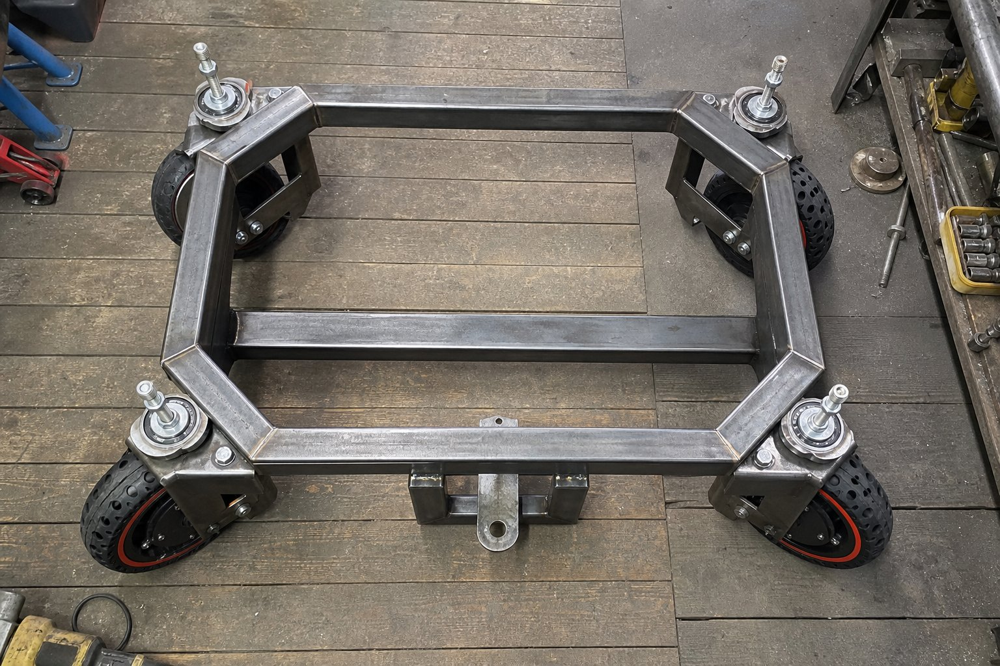
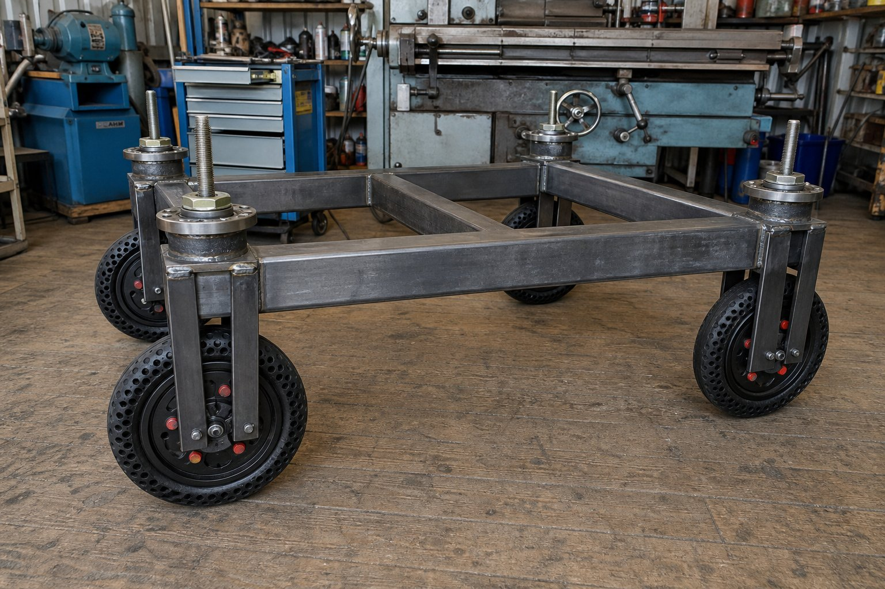

# ТЕХНИЧЕСКАЯ ДОКУМЕНТАЦИЯ И ПАСПОРТ ИЗДЕЛИЯ

## Автономная роботизированная платформа с крабовым ходом (4WIS / 4WID) для внутризаводской логистики НТЦ АО «АВТОВАЗ»

---

## 1. НАЗНАЧЕНИЕ И ОБЩИЕ СВЕДЕНИЯ

Роботизированный комплекс представляет собой тяжелую высокоманевренную мобильную платформу с полноуправляемым шасси типа **4WIS / 4WID** (*Four-Wheel Independent Steering / Four-Wheel Independent Drive*), предназначенную для автоматизированной транспортировки тяжелых комплектующих, узлов в сборе, штампов, технологической оснастки и документации по территории Научно-технического центра (НТЦ) АО «АВТОВАЗ» (площадью от 20 гектаров) в рамках конкурсного задания № 2.

Платформа спроектирована под повышенную **грузоподъемность 250 кг** и сочетает в себе сверхвысокую маневренность (крабовый ход, разворот на месте с нулевым радиусом, диагональное перемещение) и исключительную механическую прочность благодаря применению автомобильных ступиц Subaru в качестве поворотных опор и сварной рамы из стального профиля 40×40×2 мм.


---

## 2. ОСНОВНЫЕ ТЕХНИЧЕСКИЕ ХАРАКТЕРИСТИКИ

| Параметр | Значение | Примечание |
| :--- | :--- | :--- |
| **Габариты платформы (Д × Ш × В)** | **750 × 600 × 400 мм** | Точно соответствует регламенту (норматив: 600–1200 × 400–800 × 400–800 мм) |
| **Колесная база (L) / Колея (W)** | 550 мм / 460 мм | Компактная устойчивая база под нагрузку 250 кг |
| **Снаряженная масса платформы** | 39.5 кг | С учетом АКБ, 4 модулей и защитного металлокаркаса |
| **Номинальная грузоподъемность** | **250.0 кг** | Расчетная прочность рамы и ступиц с запасом до 350 кг |
| **Полная масса с грузом** | **289.5 кг** | Нагрузка на один модуль: ~72.4 кг (для ступиц Subaru это менее 15% от номинала) |
| **Клиренс (дорожный просвет)** | 100 мм | Беспрепятственный проезд через искусственные неровности |
| **Тип привода поворота колес** | 4 × шаговый двигатель NEMA 23 | С редуктором 1:7.5 (ремень GT2 10 мм, шкивы 20 и 150 зубьев) |
| **Тип тягового привода** | 4 × мотор-колесо Xiaomi M365 Pro (BLDC) | 10 дюймов, номинальная мощность **260 Вт** на колесо, со встроенным энкодером |
| **Суммарная мощность тяги** | **1040 Вт** (номинал) / до 1600 Вт (пик) | Полноприводная схема 4WD с раздельным управлением |
| **Максимальная расчетная скорость** | до 15 км/ч (4.2 м/с) | Программно ограничена до 6–8 км/ч в целях безопасности |
| **Минимальный радиус разворота** | 0.0 м (разворот на месте) | Вращение вокруг геометрического центра платформы |
| **Упорно-поворотные узлы** | Оригинальные ступицы Subaru | Двухрядные радиально-упорные подшипники качения |
| **Тип аккумуляторной батареи** | LiFePO4, 12S 3P | 36 цилиндрических банок типоразмера 32700 |
| **Номинальное напряжение АКБ** | 38.4 В (диапазон 30.0 В – 43.8 В) | Повышенная безопасность и долговечность (>2500 циклов) |
| **Емкость батарейного блока** | 18.6 А·ч (~714 Вт·ч) | 3 параллельных цепочки по 6200 мА·ч |
| **Расчетный запас хода** | до 20–25 км | В зависимости от нагрузки и рельефа |
| **Бортовой управляющий компьютер** | SBC / Mini-PC с ОС Ubuntu 24.04/26.04 | ROS 2 (Robot Operating System), Nav2, SLAM, CV |
| **Сенсор навигации и безопасности** | **Лидар LDC 01** (360°) + Камера | Обнаружение препятствий, знаков («Стоп», светофор) |
| **Локальные контроллеры модулей** | 4 × Arduino Mega Pro (Embed) | По одной плате на каждый поворотный модуль |
| **Драйверы приводов** | TB6600 (шаговики) + 3-ф MOSFET | Раздельное силовое управление на каждом колесе |

---

## 3. МЕХАНИЧЕСКАЯ ЧАСТЬ И СИЛОВАЯ КОНСТРУКЦИЯ

### 3.1. Фотографии изготовленного шасси (Промежуточный конструктив)

Ниже представлены фотографии сваренного несущего металлокаркаса и механической сборки шасси без установленной электроники (промежуточный конструктив механической части):

| Вид сверху (Рама 40×40 мм, скосы 45°, ступицы Subaru) | Вид сбоку (Вертикальный стек: шпилька → ступица → вилка) | Перспектива 3/4 (Шасси в сборе на 4 колесах) |
| :---: | :---: | :---: |
|  |  |  |

---

### 3.2. Сварная пространственная рама под нагрузку 250 кг

Рама робота представляет собой цельносварную пространственную конструкцию, изготовленную из **стальной профильной трубы 40×40 мм с толщиной стенки 2.0 мм** (сталь Ст3сп по ГОСТ 8639-82).

- **Особенности геометрии рамы (750 × 600 мм):**
  - Передняя и задняя поперечины рамы выполнены со **скошенными под 45° углами (октагональная форма контура)**. Данная форма предотвращает задевание колес за раму при повороте на предельные углы, увеличивает жесткость на кручение и снижает вероятность зацепления за препятствия при маневрировании;
  - Поперечные балки и центральные вертикальные стойки образуют жесткую ферму для размещения грузового отсека под полезную нагрузку 250 кг;
  - Момент сопротивления профиля 40×40×2 мм составляет $W \approx 3.71 \text{ см}^3$, обеспечивая более чем 6-кратный запас прочности относительно предела текучести стали Ст3сп.

---

### 3.3. Вертикальная компоновка поворотного модуля: Шкив/Шестерня → Ступица → Вилка

В конструкции строго реализован следующий вертикальный порядок сборки поворотного узла:

```text
  [1. ВЕДОМЫЙ ШКИВ / ШЕСТЕРНЯ z2=150] (СВЕРХУ на центральной шпильке М16/М20)
                  │
  [2. АВТОМОБИЛЬНАЯ СТУПИЦА SUBARU] (ПОСЕРЕДИНЕ, закреплена в сварной раме 40×40 мм)
                  │
  [3. ПОВОРОТНАЯ СТАЛЬНАЯ ВИЛКА] (СНИЗУ, прикреплена к вращающейся части ступицы)
                  │
  [4. МОТОР-КОЛЕСО XIAOMI M365 PRO] (В ВИЛКЕ, перфорированная шина, датчики Холла + энкодер)
```


#### Инженерные преимущества компоновки:
1. **Шестерня/Шкив сверху:** Приводная шестерня (ведомый шкив GT2 $z_2 = 150$) и шаговый двигатель NEMA 23 располагаются **в верхней защищенной зоне** над рамой. Зубчатый ремень и шкивы защищены от попадания грязи, песка, камней и луж с дорожного полотна.
2. **Ступица Subaru в плоскости рамы:** Воспринимает все осевые (вертикальный вес 250 кг) и радиальные нагрузки (удары о бордюры и неровности). Двухрядный радиально-упорный подшипник ступицы Subaru обладает динамической грузоподъемностью свыше 38 кН, что исключает возникновение люфта поворотной стойки.
3. **Стальная вилка снизу:** Сварная конструкция из листовой стали толщиной 5–6 мм жестко охватывает мотор-колесо Xiaomi M365 Pro с двух сторон, надежно фиксируя силовую ось и предотвращая проворот оси в дропаутах.
4. **Колеса с цельнолитыми перфорированными шинами:** Отсутствует риск прокола пневмокамеры металлической стружкой или гвоздями на территории цехов и склада НТЦ «АВТОВАЗ». Радиальные сквозные отверстия в шине обеспечивают упругую демпфирующую амортизацию мелких неровностей дорожного полотна.

---

## 4. ПОВОРОТНЫЙ ПРИВОД: NEMA 23, РЕМЕНЬ GT2 10 ММ И ШКИВЫ 150/20

Поворот каждого из 4 модулей осуществляется шаговым двигателем NEMA 23 через зубчато-ременную передачу.

### 4.1. Параметры компонентов привода:
- **Шаговый двигатель:** NEMA 23 (двухфазный биполярный 57×57×76 мм):
  - Угловой шаг: $1.8^\circ$ (200 шагов/оборот);
  - Номинальный ток фазы: $2.8 \text{ А}$;
  - Удерживающий момент: $M_{hold} = 1.9 \text{ Н}\cdot\text{м}$;
- **Зубчато-ременная передача:**
  - Тип профиля ремня: **GT2** (шаг 2.0 мм, ширина ремня **10 мм**, стекловолоконный силовой корд);
  - Ведущий шкив (на валу NEMA 23): **$z_1 = 20$ зубьев** (делительный диаметр $d_1 = 12.73 \text{ мм}$);
  - Ведомый шкив (на ступице Subaru): **$z_2 = 150$ зубьев** (делительный диаметр $d_2 = 95.49 \text{ мм}$);
  - Передаточное отношение:
    $$i = \frac{z_2}{z_1} = \frac{150}{20} = 7.5$$


### 4.2. Расчет крутящего момента поворота под нагрузкой 250 кг

1. **Результирующий момент поворота поворотного узла:**
   При КПД зубчатой передачи $\eta \approx 0.96$:
   $$M_{pivot} = M_{nema} \times i \times \eta = 1.9 \text{ Н}\cdot\text{м} \times 7.5 \times 0.96 \approx 13.68 \text{ Н}\cdot\text{м}$$

2. **Момент сопротивления повороту колеса на месте:**
   При полной нагрузке 250 кг вертикальная реакция на одно колесо составляет $N \approx 720 \text{ Н}$. При коэффициенте трения покоя резины об асфальт $\mu = 0.75$ и радиусе пятна контакта $r_{c} \approx 0.028 \text{ м}$:
   $$M_{turn\_resist} \approx \frac{2}{3} \cdot \mu \cdot N \cdot r_{c} \approx \frac{2}{3} \times 0.75 \times 720 \times 0.028 \approx 10.08 \text{ Н}\cdot\text{м}$$
   Результирующий момент $M_{pivot} = 13.68 \text{ Н}\cdot\text{м}$ превышает сопротивление поворота даже на сухом шероховатом асфальте при максимальной загрузке 250 кг (запас по моменту составляет более 35%). При движении робота сопротивление повороту падает в 3–5 раз.

3. **Точность позиционирования:**
   - Драйвер TB6600 работает с делением шага $1/8$ (1600 импульсов на оборот двигателя);
   - На полный оборот поворотного модуля ($360^\circ$) приходится:
     $$N_{steps} = 1600 \times 7.5 = 12\,000 \text{ шагов}$$
   - Угловая дискретность:
     $$\Delta \theta = \frac{360^\circ}{12\,000} = 0.03^\circ \text{ на шаг}$$

---

## 5. ТЯГОВЫЙ ПРИВОД: 4 МОТОР-КОЛЕСА XIAOMI M365 PRO С ЭНКОДЕРАМИ


### Технические параметры привода:
- 4 бесщеточных мотор-колеса от электросамоката **Xiaomi Mijia M365 Pro** диаметром **10 дюймов** ($D = 254 \text{ мм}$, радиус $R = 0.127 \text{ м}$);
- Номинальная мощность каждого колеса: **260 Вт** (пиковая мощность до 600 Вт при разгоне под нагрузкой 250 кг);
- Суммарная мощность 4WD шасси: $4 \times 260 = \mathbf{1040 \text{ Вт}}$ (пиковая до 1600–2400 Вт);
- Номинальный крутящий момент мотор-колеса: $M_{mot} \approx 11.5 \text{ Н}\cdot\text{м}$ (до 15–16 Н·м в пике);
- **Встроенная сенсорная система мотор-колеса Xiaomi M365 Pro:**
  1. **3 цифровых датчика Холла:** используются для надежной 6-тактной аппаратной коммутации обмоток статора через 3-фазный мост MOSFET;
  2. **Встроенный квадратурный энкодер (Quadrature Encoder, каналы A и B):** подключен к аппаратным входам прерываний Arduino Mega Pro (`D20/INT3` и `D21/INT2`), обеспечивая:
     - Высокоточную одометрию с разрешением в доли миллиметра на тик;
     - Замкнутый контур ПИД-регулирования скорости (Closed-loop PID) при движении на сверхмалых скоростях (0.05–0.2 м/с при точной стыковке);
     - Мгновенную детекцию пробуксовки колес (*Traction Control System*) путем сопоставления линейной скорости обода со скоростью по Лидару LDC 01;
- Суммарное тяговое усилие на ободах 4 колес:
  $$F_{traction} = 4 \times \frac{M_{mot}}{R} = 4 \times \frac{11.5 \text{ Н}\cdot\text{м}}{0.127 \text{ м}} \approx 362 \text{ Н} \approx 37 \text{ кгс}$$
- Сила сопротивления качению робота с полной массой 289.5 кг по ровному асфальту ($f_{roll} = 0.02$):
  $$F_{roll} = m_{total} \cdot g \cdot f_{roll} = 289.5 \text{ кг} \times 9.81 \text{ м/с}^2 \times 0.02 \approx 56.8 \text{ Н}$$
- Тягового усилия **362 Н** с избытком достаточно для уверенного разгона платформы с полезным грузом 250 кг и преодоления уклонов до $8–10^\circ$ ($14–17\%$).

---

## 6. КИНЕМАТИКА КРАБОВОГО ХОДА (4WIS / 4WID)


Для каждого из 4 колес $i \in \{1, 2, 3, 4\}$ с координатами $(x_i, y_i)$ относительно центра масс платформы при задании глобальной скорости робота $(V_x, V_y, \omega_z)$ вычисляются составляющие вектора скорости:

$$V_{x, i} = V_x - \omega_z \cdot y_i$$
$$V_{y, i} = V_y + \omega_z \cdot x_i$$

Требуемый угол поворота колеса $\delta_i$ и модуль линейной скорости $V_i$ определяются выражениями:
$$\delta_i = \arctan\left(\frac{V_{y, i}}{V_{x, i}}\right) \quad (\text{с учетом квадранта через функцию atan2})$$
$$V_i = \sqrt{V_{x, i}^2 + V_{y, i}^2}$$

### Основные режимы маневрирования:
1. **Крабовый ход (Crab / Omnidirectional):**
   При $\omega_z = 0$, $V_x \ne 0, V_y \ne 0$:
   - Все 4 колеса ориентируются строго под одним углом:
     $$\delta_1 = \delta_2 = \delta_3 = \delta_4 = \arctan\left(\frac{V_y}{V_x}\right)$$
   - Линейные скорости всех колес равны:
     $$V_1 = V_2 = V_3 = V_4 = \sqrt{V_x^2 + V_y^2}$$
   - Платформа выполняет поступательное диагональное или чисто боковое перемещение без изменения курсового угла корпуса.

2. **Разворот на месте с нулевым радиусом (Zero-Radius Spin, $R = 0$):**
   При $V_x = 0, V_y = 0$, $\omega_z = \Omega \ne 0$:
   - Координаты модулей: $x = \pm L/2 = \pm 275 \text{ мм}$, $y = \pm W/2 = \pm 230 \text{ мм}$;
   - Центр мгновенного вращения (ICR) находится строго в геометрическом центре платформы $(0, 0)$;
   - Радиус описанной окружности траектории колес:
     $$R_{turn} = \frac{1}{2}\sqrt{L^2 + W^2} = \frac{1}{2}\sqrt{550^2 + 460^2} \approx 358.5 \text{ мм}$$
   - **Геометрическое правило установки колес:** Плоскость качения каждого из 4 колес ориентируется **строго по касательной к окружности радиуса $R_{turn}$** (то есть строго перпендикулярно диагональному лучу, проведенному из центра платформы к оси ступицы данного колеса);
   - Составляющие скорости для каждого колеса:
     $$V_{x, i} = -\Omega \cdot y_i, \quad V_{y, i} = +\Omega \cdot x_i$$
   - Линейные скорости всех 4 колес согласованы по модулю:
     $$V_i = |\Omega| \cdot R_{turn}$$
   - Направление векторов скорости образует замкнутый круговой контур: передние и задние колеса согласованно создают чистый вращающий момент вокруг вертикальной оси. Колеса катятся по дуге без паразитного бокового юза и повышенного износа протектора!

---

## 7. РАСПРЕДЕЛЕННАЯ ЭЛЕКТРОНИКА И ПЛАТЫ МОДУЛЕЙ


Управление распределено по **4 специализированным платам** (по одной плате на каждый поворотный модуль):

1. **Микроконтроллер Arduino Mega Pro (Embed, ATmega2560):**
   - Тактовая частота 16 МГц, 54 цифровых I/O, 4 аппаратных UART;
   - Обработка прерываний от 3 датчиков Холла мотор-колеса;
   - Генерация импульсов шага PUL/DIR для TB6600;
   - Формирование 6-тактного ШИМ-управления фазами инвертора;
   - Прием команд от бортового ПК по UART (115200 бит/с с контрольной суммой CRC16).
2. **Драйвер шагового двигателя TB6600:**
   - Настройка деления: микрошаг 1/8 (1600 имп/об);
   - Рабочий ток: 2.8 А;
   - Силовое питание: линия 24 В DC.
3. **3-фазный мостовой силовой инвертор на MOSFET:**
   - 6 мощных N-канальных полевых транзисторов IRFB4110 ($V_{DS} = 100 \text{ В}$, $I_D = 180 \text{ А}$, $R_{DS(on)} \le 4.5 \text{ мОм}$);
   - Полумостовые драйверы затворов FD6288/IR2101;
   - Токовый шунт в минусовой шине с операционным усилителем.


---

## 8. АККУМУЛЯТОРНАЯ БАТАРЕЯ (LiFePO4 12S 3P, 36 БАНОК 32700)


Батарея собрана из **36 элементов LiFePO4 типоразмера 32700** по схеме **12S 3P** (12 последовательных троек).

| Параметр | Значение |
| :--- | :--- |
| **Количество ячеек** | 36 шт. (32700 LiFePO4) |
| **Номинальное напряжение** | 38.4 В ($12 \times 3.2 \text{ В}$) |
| **Диапазон рабочего напряжения** | 30.0 В (разряд) — 43.8 В (полный заряд) |
| **Емкость сборки** | 18.6 А·ч ($3 \times 6200 \text{ мА}\cdot\text{ч}$) |
| **Запас энергии** | ~714.2 Вт·ч |
| **Плата защиты (BMS)** | Smart BMS 12S LiFePO4 60A с балансировкой |
| **Пожаробезопасность** | Полная термическая стабильность LiFePO4 химии |
| **Срок службы** | Более 2500 циклов (до падения емкости до 80%) |

---

## 9. НАВИГАЦИЯ, БОРТОВОЙ КОМПЬЮТЕР И ЛИДАР LDC 01

- **Бортовой компьютер:** Промышленный компактный компьютер под управлением **Ubuntu 24.04/26.04 LTS**;
- **Лидар LDC 01:** Лазерный круговой сканер (360° LiDAR LDC 01, частота 5–10 Гц), обеспечивающий обнаружение препятствий на расстоянии до 8–12 метров;
- **Навигационный стек:** ROS 2 Nav2, SLAM Toolbox для построения карты и локализации, модуль компьютерного зрения (YOLOv8) для детекции дорожных знаков («Стоп», «Пешеходный переход», «Искусственная неровность») и сигналов светофора.

---

## 10. ПРОГРАММА И МЕТОДИКА ПЛАНИРУЕМЫХ КОНТРОЛЬНЫХ ИСПЫТАНИЙ

> **Примечание:** В текущий момент робототехнический комплекс находится на этапе изготовления, стендовой сборки и лабораторной калибровки подсистем. Натурные полигонные испытания запланированы к проведению в рамках очного этапа соревнований на специально оборудованной площадке по регламенту Задания № 2.

### Методика проведения испытаний (согласно Регламенту):
1. **Тест прямолинейного движения 50 м с одной остановкой:**
   - Отрезок прямой трассы длиной 50 метров;
   - Автономный старт, проезд участка, остановка на светофоре или перед знаком «Стоп», возобновление движения и финиш за время менее 3 минут (норматив высшего балла).
2. **Тест транспортировки груза (до 250 кг):**
   - Проверка геометрических параметров грузового отсека (соответствие требованиям: коробка $\ge 300\times 250\times 60$ мм, цилиндр $\ge 200\times 100$ мм);
   - Контроль стабильности движения под нагрузкой и надежности фиксации замка грузового отсека.
3. **Тест распознавания дорожной инфраструктуры:**
   - Распознавание дорожного знака «Стоп» (2.5) с остановкой перед стоп-линией;
   - Распознавание цветовой индикации светофора (остановка на красный, проезд на зеленый);
   - Проезд искусственной неровности с автоматическим снижением скорости.
4. **Тест автономного объезда препятствий:**
   - Обнаружение статического/динамического препятствия лидаром **LDC 01**;
   - Перестроение локальной траектории с задействованием преимуществ крабового хода (боковой уход без изменения курсового угла).
